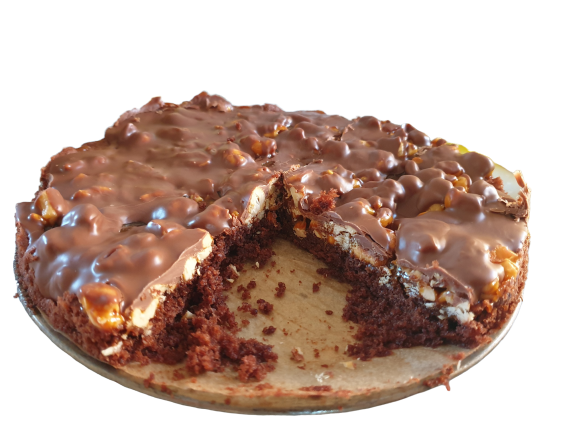

# CCC, Cashew Caramel Cake

... wurde erstmalig von Moritz am 2020-04-11 improvisiert.

Die Menge ist sehr gering, man kann's aber natürlich hoch skalieren

## Kuchenboden

Rührteig mit Kakaopulver. Zutaten:

* 1 Ei
* 60g Zucker
* 60g Butter oder Margarine, weich.
* 60g Mehl
* 1 EL Kakaopulver (ungesüßt)
* 1 Prise Salz
* 1/2 TL Backpulver

Ei aufschlagen und mit Zucker schaumig rühren. Restliche Zutaten untermischen, gut rühren.

Eine kleine Springform mit Butter oder Margarine auspinseln, evtl. Boden mit Backpapier belegen, und den Teig dünn und gleichmäßig verteilen.

Bei 180°C ca. 15 Minuten backen, bis der Zahnstochertest positiv ist.

Wenn fertig, abkühlen lassen.

## Füllung

Zutaten:

* 80g Zucker
* 15g Butter
* 30-40ml Sahne
* 100g gesalzene Cashews
* ca. 100g Kuvertüre

Cashews etwas kleiner zerhacken.

Zucker in einer Pfanne schmelzen, möglichst nicht rühren. Wenn alles geschmolzen ist, mit Butter und Sahne ablöschen und glatt verrühren.

Cashews in das so entstandene Karamell einrühren, und auf dem Kuchenboden verteilen.

Dann abkühlen lassen.

Kuvertüre im Wasserbad (oder, wenn vom Hersteller vorgesehen, in der Mikrowelle) schmelzen und über dem Karamell auf dem Kuchen verteilen.

Im Kühlschrank kühlen.

Essen.
